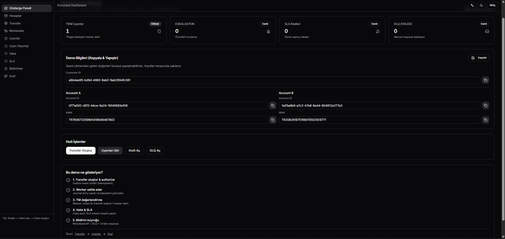
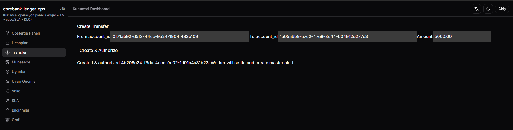
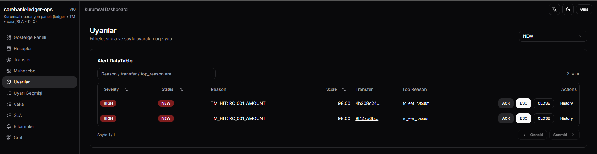
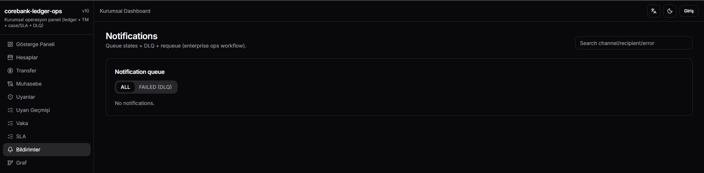

# CoreBank Ledger — V10

## 📸 Ekran Görüntüleri






> **TR (Türkçe)** aşağıda başlar. **EN (English)** versiyonu Türkçe bölümün hemen altındadır.

---

# 🇹🇷 Türkçe (TR)

## 1) Proje Ne Yapıyor?

**CoreBank Ledger V10**, çekirdek bankacılık konseptlerini (hesap, bakiye, transfer, muhasebe fişi/ledger) ve operasyon tarafını (transaction monitoring / fraud alert, case yönetimi, SLA takibi, outbox + worker, bildirim kuyruğu, DLQ) tek bir demo projede birleştiren **uçtan uca** bir örnek uygulamadır.

Kısaca akış:
1. Bir **transfer** oluşturulur ve authorize edilir.
2. Transfer bir **Outbox event** üretir.
3. **Celery worker** outbox’ı tüketir → muhasebe fişi (journal entry) post eder → bakiyeyi günceller → transferi **SETTLED** yapar.
4. Aynı anda transfer, **Transaction Monitoring** kurallarından geçer:
   - **Tek transfer başına tek “master alert”** üretilir (aggregated)
   - Alert içinde **reason code**’lar (örn. `RC_001_AMOUNT`, `RC_010_VELOCITY`) ve açıklayıcı `explain_json` bulunur.
5. Alert üzerinden **case** açılır ve SLA atanır.
6. SLA süresi geçerse case **SLA breached** olur → outbox event → **notification queue**.
7. Bildirimler (EMAIL/SLACK mock) retry/backoff ile gönderilir. Maksimum denemede **FAILED (DLQ)** olur ve yeniden kuyruğa alınabilir (**requeue**).
8. **Graph ekranı**, customer → account → transfer → alert → case ilişkisini görselleştirir. Node seçince sağ panelde **canlı detay** çeker; alert node’unda tek tıkla **case oluştur** aksiyonu vardır.

---

## 2) V10 Özellikleri (Özet)

### Çekirdek Bankacılık
- Hesaplar ve bakiye (ledger/available)
- Transfer oluşturma + authorize
- Outbox pattern
- Worker ile settlement + ledger posting
- Trial balance ve journal entries

### Transaction Monitoring (Fraud)
- Transfer başına **tek master alert** (alert aggregation)
- **Reason code** tabanlı hit’ler + `explain_json`
- **Hit dedupe**: aynı reason code birden çok kez tetiklenirse en yüksek weight’li hit tutulur
- `top_reason_code`: triage için hızlı önceliklendirme
- **Normalized scoring**: severity faktörü ile ağırlıklandırılmış skor, **0..100** aralığına clamp
- **Rule versioning**: `fraud_rules.version` alanı; anlamlı update’lerde otomatik artar
- Hit’lerde `rule_version` gösterilir

### Alert State Machine + Audit
- Alert status geçişleri (NEW → ACK → ESCALATED → CLOSED, vb.)
- Alert history kaydı

### Case + SLA
- Case oluşturma/atama/kapama
- SLA due at, SLA breach işaretleme
- SLA breach listesi

### Notifications + DLQ
- Bildirim kuyruğu: `PENDING/RETRY/SENT/FAILED`
- Retry/backoff + `max_attempts`
- **DLQ (FAILED) ekranı** + **requeue**
  - API: `GET /notifications/failed`
  - API: `POST /notifications/{id}/requeue`

### Graph + Operasyon UX
- Customer graph görselleştirme + filtreler
- Node select → canlı API detail fetch
- Alert node panel: **Create Case (1h SLA)** aksiyonu

---

## 3) Teknoloji Stack’i
- **API:** FastAPI + SQLAlchemy + Alembic
- **DB:** PostgreSQL
- **Queue/Worker:** Redis + Celery
- **Web:** Next.js (client-side)
- **Observability:** Prometheus metrik endpoint (`/metrics`)
- **Orkestrasyon:** Docker Compose

---

## 4) Gereksinimler

### Önerilen (En Kolay): Docker ile
- Docker Desktop (Windows/macOS) veya Docker Engine (Linux)
- Docker Compose (Docker Desktop ile gelir)
- (Opsiyonel) `make`

> Windows kullanıyorsan en sorunsuz yol: **Docker Desktop + WSL2**. `make` yoksa, aşağıdaki docker compose komutlarını direkt çalıştırabilirsin.

---


## 5) Demo Senaryosu (Uçtan Uca)

### 5.1 Transfer → Alert
1) Web → **Accounts** sayfasından Account A ve B id’lerini al.
2) Web → **Transfer** sayfasında:
   - from = Account A
   - to = Account B
   - amount = 5000+ (ör. 5000.00)
   - Create & Authorize
3) Worker log’larında settlement + ledger posting görürsün.
4) Web → **Alerts**:
   - master alert oluşur
   - `top_reason_code` ve `explain_json` görülür

### 5.2 Alert → Case
- Web → **Graph**:
  1) Seed çıktısındaki `customer_id` ile graph yükle
  2) Alert node’una tıkla
  3) Sağ panelde **Create Case (1h SLA)** butonuna bas

### 5.3 SLA Breach → Notifications
1) Web → **Cases**: SLA’yı geçmiş bir tarih vererek case aç veya oluşturduğun case’in SLA’sını geçmişe çek
2) Worker 30 sn aralıkla SLA breach kontrol eder.
3) Web → **Notifications**:
   - EMAIL: PENDING → SENT
   - SLACK: PENDING → RETRY → SENT

### 5.4 FAILED (DLQ) → Requeue
- Bazı senaryolarda max_attempts aşılırsa notification **FAILED** olur.
- Web → Notifications → “Failed (DLQ)” sekmesine geç
- **Requeue** butonuna bas

---

## 6) Önemli Endpoint’ler

- **Auth**
  - `POST /auth/login`
  - `GET /auth/me`

- **Payments / Transfers**
  - `POST /transfers`
  - `POST /transfers/{id}/authorize`
  - `GET /transfers/{id}`

- **Fraud**
  - `GET /fraud/rules`
  - `PATCH /fraud/rules/{id}` (version artabilir)
  - `GET /fraud/alerts`
  - `GET /fraud/alerts/{id}`
  - `GET /fraud/alerts/{id}/history`

- **Cases**
  - `POST /cases`
  - `GET /cases`
  - `GET /cases/{id}`
  - `GET /cases/sla-breaches`

- **Notifications**
  - `GET /notifications`
  - `GET /notifications/failed`
  - `POST /notifications/{id}/requeue`

- **Graph**
  - `GET /graph/customer/{customer_id}`

- **Metrics**
  - `GET /metrics`

---

## 7) Sorun Giderme

### Portlar doluysa
- 8000 (API), 3000 (Web), 5432 (Postgres), 6379 (Redis)
- Başka servis kullanıyorsa kapat veya compose portlarını değiştir.

### Worker çalışmıyorsa
- Ayrı terminalde worker komutunu çalıştırdığından emin ol.
- Log bak:
  ```bash
  docker compose logs -f api
  docker compose logs -f web
  ```

### Migration sorunları
- Temiz başlamak için:
  ```bash
  docker compose down -v
  docker compose up -d --build
  docker compose exec api bash -lc "alembic upgrade head"
  docker compose exec api bash -lc "python -m src.scripts.seed"
  ```

---

# 🇬🇧 English (EN)

## 1) What does this project do?

**CoreBank Ledger V10** is an end-to-end demo that combines core banking concepts (accounts, balances, transfers, double-entry ledger) with operational tooling (transaction monitoring / alerts, case management, SLA tracking, outbox + worker processing, notification queue with retry/backoff, dead-letter queue).

High-level flow:
1. Create and authorize a **transfer**.
2. Transfer emits an **Outbox event**.
3. A **Celery worker** consumes the outbox → posts a journal entry → updates balances → marks transfer as **SETTLED**.
4. Transfer goes through **Transaction Monitoring** rules:
   - one **master alert per transfer** (aggregation)
   - alerts include **reason codes** (e.g., `RC_001_AMOUNT`, `RC_010_VELOCITY`) and a rich `explain_json`.
5. Create a **case** from an alert and assign an SLA.
6. When SLA expires, case becomes **SLA breached** → outbox → **notification queue**.
7. Notifications (EMAIL/SLACK mock) are sent with retry/backoff. Exceeding max attempts becomes **FAILED (DLQ)** and can be **requeued**.
8. The **Graph UI** visualizes customer → account → transfer → alert → case; selecting a node fetches live detail JSON; alert nodes provide a one-click **Create Case** action.

---

## 2) V10 Features

### Core Banking
- Accounts and balances (ledger/available)
- Transfer create + authorize
- Outbox pattern
- Worker-driven settlement + ledger posting
- Trial balance and journal entries

### Transaction Monitoring (Fraud)
- One master alert per transfer (aggregation)
- Reason-code hits + `explain_json`
- Hit dedupe per reason code (keep highest weight)
- `top_reason_code` for triage
- Normalized scoring with severity multipliers, clamped to 0..100
- Rule versioning: `fraud_rules.version` auto-increments on meaningful updates
- Hits include `rule_version`

### Alert State Machine + Audit
- Alert status transitions and alert history

### Case + SLA
- Create/assign/close cases
- SLA breach detection and listing

### Notifications + DLQ
- Queue states: `PENDING/RETRY/SENT/FAILED`
- Retry/backoff + `max_attempts`
- DLQ listing + requeue:
  - `GET /notifications/failed`
  - `POST /notifications/{id}/requeue`

### Graph UX
- Filters + deep links
- Live detail fetch on node select
- Create Case action from alert node

---

## 3) Requirements

Recommended:
- Docker + Docker Compose
- (Optional) make

---

## 4) Run locally
```bash
cd corebank-ledger-v10

docker compose up -d --build

docker compose exec api bash -lc "alembic upgrade head"
docker compose exec api bash -lc "python -m src.scripts.seed"

# in a second terminal

docker compose exec api bash -lc "celery -A src.worker.celery_app worker -l info"
```

Open:
- Web: http://localhost:3000
- API docs: http://localhost:8000/docs

Login:
- admin@demo.local / Admin123!

---
